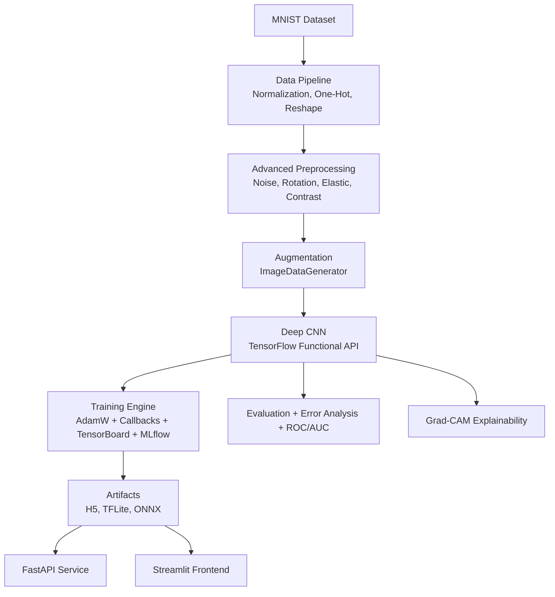

# Advanced Handwritten Digit Recognition Platform

## Problem Statement
Handwritten digit recognition in real-world scenarios suffers from noisy input, style variance, and deployment fragmentation. This platform delivers a full production-grade ML system that trains a robust deep CNN, evaluates model quality comprehensively, explains predictions with Grad-CAM, and serves inference through both API and UI layers.

## System Architecture


## Tech Stack
- Python 3.10+
- TensorFlow / Keras (Functional API)
- NumPy, Pandas
- Matplotlib, Seaborn
- OpenCV
- FastAPI
- Streamlit
- Docker
- GitHub Actions
- MLflow

## Project Structure
```text
digit-ai-system/
├── data/
├── models/
│   ├── cnn_model.h5
│   ├── model.tflite
│   └── model.onnx
├── src/
│   ├── data_pipeline.py
│   ├── model.py
│   ├── train.py
│   ├── evaluate.py
│   ├── explainability.py
│   └── utils.py
├── api/
│   └── main.py
├── app/
│   └── streamlit_app.py
├── notebooks/
│   └── research.ipynb
├── plots/
├── docker/
│   └── Dockerfile
├── tests/
├── .github/workflows/
│   └── ci.yml
├── k8s/
│   ├── deployment.yaml
│   └── service.yaml
├── requirements.txt
└── README.md
```

## Model Architecture
- Block 1: Conv2D(32,same) -> BN -> ReLU -> Conv2D(32) -> MaxPool -> Dropout(0.25)
- Block 2: Conv2D(64) -> BN -> ReLU -> Conv2D(64) -> MaxPool -> Dropout(0.25)
- Block 3: Conv2D(128) -> BN -> ReLU -> GlobalAveragePooling2D
- FC: Dense(128,relu) -> BN -> Dropout(0.5)
- Output: Dense(10,softmax)

## Training Optimization
- Optimizer: AdamW with weight decay
- Loss: categorical_crossentropy
- Metrics: accuracy
- Callbacks: EarlyStopping, ReduceLROnPlateau, ModelCheckpoint, TensorBoard
- Experiment Tracking: MLflow

## Performance Target
- Expected: >99% test accuracy after full training with augmentation and optimization.
- Actual metrics are saved into MLflow and `plots/classification_report.txt`.

## Evaluation Outputs
- Confusion matrix heatmap (`plots/confusion_matrix.png`)
- Multi-class ROC and AUC (`plots/roc_curves.png`)
- Precision/Recall/F1 report (`plots/classification_report.txt`)
- Error analysis (`plots/top_misclassified.png`, `plots/error_groups.txt`)

## API Usage
Run API:
```bash
uvicorn api.main:app --reload
```

Health:
```bash
GET /health
```

Predict:
```bash
POST /predict
Content-Type: multipart/form-data
file=<image>
```

## Streamlit UI
Run app:
```bash
streamlit run app/streamlit_app.py
```

Features:
- Drag-and-drop image upload
- Draw digit canvas
- Real-time prediction and confidence chart
- Grad-CAM visualization toggle

## Deployment
### Docker
```bash
docker build -f docker/Dockerfile -t digit-ai-system .
docker run -p 8000:8000 -p 8501:8501 digit-ai-system
```

### Kubernetes (Optional)
```bash
kubectl apply -f k8s/deployment.yaml
kubectl apply -f k8s/service.yaml
```

## CI/CD
- GitHub Actions workflow in `.github/workflows/ci.yml`
- Runs pytest on push and pull requests.

## Unit Tests
```bash
pytest -q
```

## Model Versioning
- `models/model_registry.json` stores versioned model metadata and metrics.

## Screenshots
- Add screenshots after running UI and place them in `plots/`:
  - `plots/ui_upload_prediction.png`
  - `plots/ui_gradcam.png`
